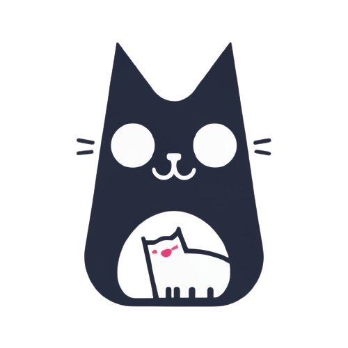

# Tincat - Tinder for Cats and Their Owners

Tincat is a fun project that replicates the Tinder web page experience, but with a twist—it's for cats and their owners! This project was created to learn and practice using HTML, Bootstrap, and CSS.

## Table of Contents
- [Demo](#demo)
- [Features](#features)
- [Installation](#installation)
- [Usage](#usage)
- [Contributing](#contributing)
- [License](#license)

## Demo
You can check out a live demo of Tincat here: [Tincat Demo](https://jaqueslucas.github.io/TinCat-Project/)

## Features
- Create profiles for your cats.
- Swipe left or right to match with other cat owners.
- Explore profiles of cats in your area.
- Chat with your matches.
- Customize your profile with cat photos and descriptions.
- Responsive design for mobile and desktop.

## Installation
To run Tincat locally, follow these steps:

1. Clone this repository to your local machine using:

2. Navigate to the project directory:

3. Open `index.html` in your web browser to start using Tincat.

## Usage
- Create a profile for your cat(s).
- Start swiping to match with other cat owners.
- Explore profiles and chat with your matches.
- Customize your profile and add adorable cat photos.

## Contributing
Contributions are welcome! If you'd like to contribute to Tincat, please follow these steps:

1. Fork the repository.
2. Create a new branch for your feature or bug fix.
3. Make your changes and test thoroughly.
4. Commit your changes with descriptive commit messages.
5. Push your changes to your fork.
6. Open a pull request to the main repository.

## License
This project is licensed under the MIT License - see the [LICENSE](LICENSE) file for details.

---
